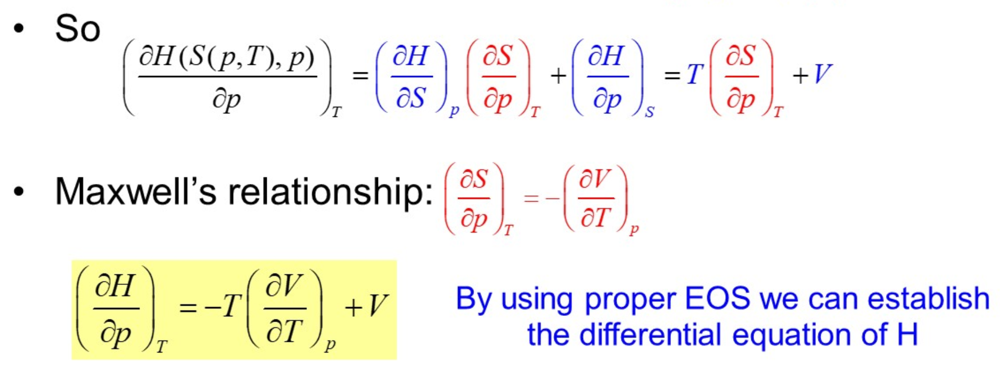
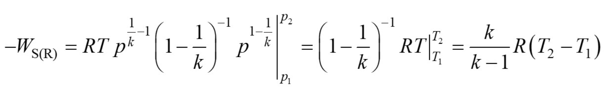

# 第三章 纯物质热力学性质与计算
## 特殊公式记忆
   - $\left[\frac{\partial(G^E / T)}{\partial T}\right]_P=-\frac{H^E}{T^2}$(普通G, E也适用)
   - $\left[\frac{\partial (G^E / T)}{\partial P}\right]_T = \frac{V}{T}$
   - 

# 第5章 相平衡热力学
## 相平衡计算
   **基本平衡式**
   - $x_ip_i^sy_i = py_i\varPhi$
   - $f$平衡
   > 即逸度平衡，列出后计算平衡
   
   **特殊公式**
   - $\frac{G^E}{RT} = \sum x_i\ln(y_i)$
   - Van Laar方程：
     - $\ln(\gamma_1) = A\left[\frac{Bx_2}{Ax_1+Bx_2}\right]^2$
     -  $\ln(\gamma_2) = B\left[\frac{Ax_1}{Ax_1+Bx_2}\right]^2$
  - 

   **共沸点条件**
   - $x_i = y_i$
   - **衍生公式:**
     - $p=p_i^sy_i$
     - $p_1^sy_1=p_2^sy_2$

## 闪蒸计算
   **物料衡算关系式**：
   - $Fz_i = Vy_i + Lx_i$
   - $z_i = ey_i + (1 -e)x_i$
  
   **各种参数**
   1. ``汽化率e`` :$e = \frac{V}{F}$
   2. ``K``: $y_i = K_ix_i$
   3. ``相对挥发度``$\alpha$:$\frac{y_1 / y_2}{x_1 / x_2}$
# 第六章 热力学第一定律及其工程应用
## 能量衡算公式
 - $\Delta H + \frac{\Delta u^2}{2} + g\Delta Z = Q - W_s$
## 解题公式
### 流速转换
- $u_2=\frac{u_1\rho_1}{\rho_2} = \frac{u_1p_1T_2}{p_2T_1}$
> ``如果没给u1，给质量流速``
- $u_1 = \frac{q_mV_1}{A_1} = \frac{q_mPM}{RT}$
### 绝热过程的功计算
- $\gamma = k = \frac{c_p}{c_v}$
- $PV^\gamma=C$
- 

# 第七章 热力学第二定律及其工程应用
